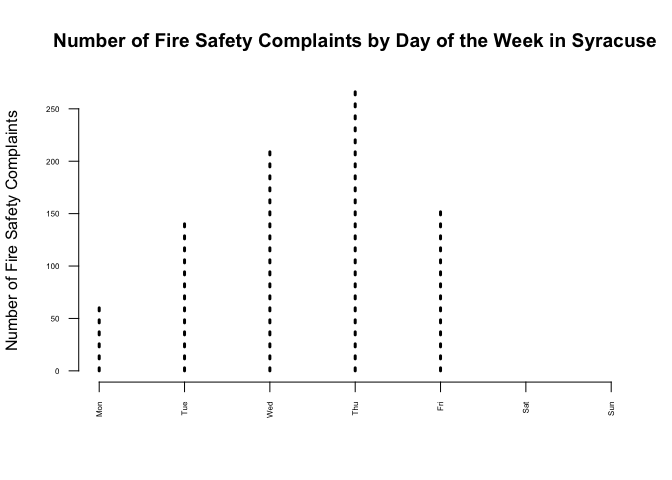
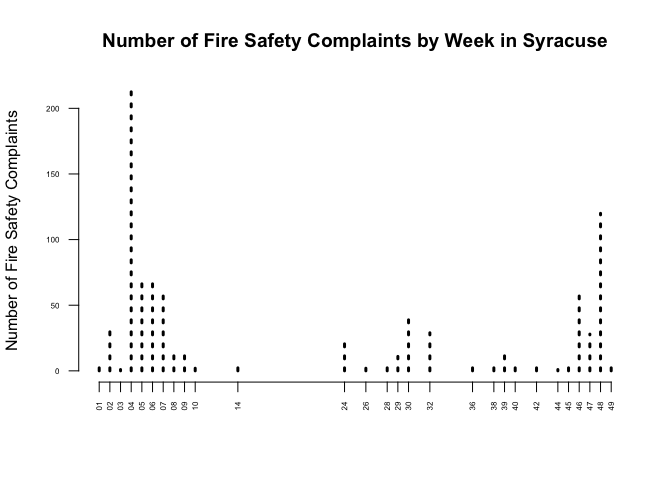
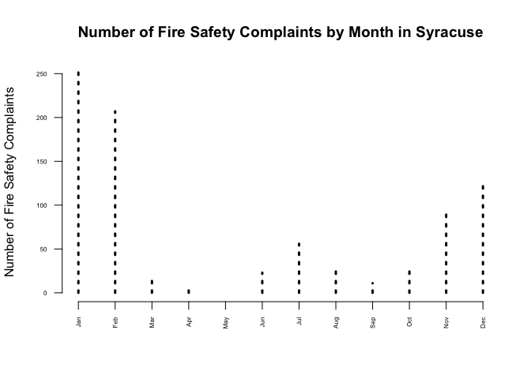
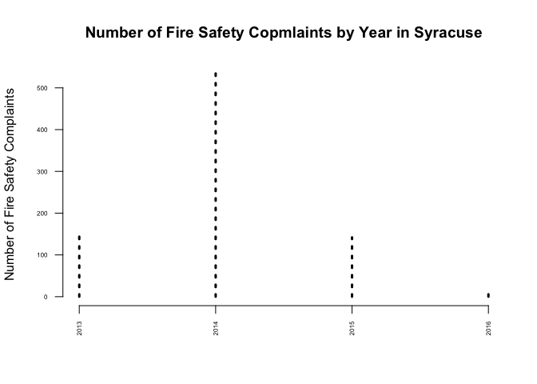
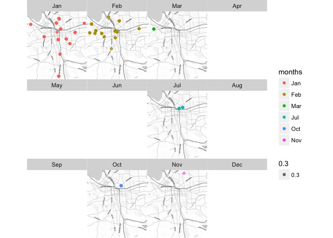

Lab01
================
Chris Davis
1/31/2017

Load libraries

``` r
library(dplyr)
```

    ## 
    ## Attaching package: 'dplyr'

    ## The following objects are masked from 'package:stats':
    ## 
    ##     filter, lag

    ## The following objects are masked from 'package:base':
    ## 
    ##     intersect, setdiff, setequal, union

``` r
library(pander)
library(ggmap)
```

    ## Loading required package: ggplot2

    ## Google Maps API Terms of Service: http://developers.google.com/maps/terms.

    ## Please cite ggmap if you use it: see citation("ggmap") for details.

Follow the steps in the Dates tutorial to read in the code violation data and drop all variables except violation dates, violation types, and their coordinates (lat,lon).

``` r
data.url <- "https://raw.githubusercontent.com/lecy/code-orange/master/data/code%20violations.csv"
dat <- read.csv( data.url, stringsAsFactors=F)
dat <- tbl_df(dat)
dat <- select(dat, Complaint.Type, Violation.Date, lat, lon) %>% tbl_df
dat
```

    ## # A tibble: 51,427 × 4
    ##               Complaint.Type   Violation.Date      lat       lon
    ##                        <chr>            <chr>    <dbl>     <dbl>
    ## 1      Illegal Trash Set Out 12/22/2011 10:25 43.02400 -76.14822
    ## 2      Illegal Trash Set Out 12/22/2011 10:26 43.02400 -76.14822
    ## 3      Illegal Trash Set Out  12/22/2011 7:30 43.02400 -76.14822
    ## 4                    Heating   2/2/2012 15:57 43.05106 -76.17247
    ## 5                    Heating   2/2/2012 15:55 43.05106 -76.17247
    ## 6                    Heating   2/2/2012 16:03 43.05106 -76.17247
    ## 7                    Heating   2/2/2012 16:00 43.05106 -76.17247
    ## 8    Tree/Limb/Stump Removal   2/2/2012 17:08 43.03547 -76.14819
    ## 9  Trash/Debris-Private, Occ  1/19/2012 11:06 43.05252 -76.14264
    ## 10  Property Maintenance-Int   1/26/2012 9:15 43.06114 -76.12280
    ## # ... with 51,417 more rows

Convert the Violation.Date from a character into a date class.

``` r
dat$Violation.Date <- as.Date( dat$Violation.Date, format="%m/%d/%Y" )
```

Create new variables for days of the week (Mon, Tues, Wed, etc.), weeks of the year (1-52), months, and years.

``` r
days <- format(dat$Violation.Date, format = "%a")
dayLabels <- c("Mon", "Tue", "Wed", "Thu", "Fri", "Sat", "Sun")
days <- factor(days, ordered = T, levels = dayLabels)


weeks <- format(dat$Violation.Date, format = "%U")

months <- format(dat$Violation.Date, format = "%b")
in.order <- c("Jan","Feb","Mar","Apr","May","Jun","Jul","Aug","Sep","Oct","Nov","Dec")
months <- factor(months, ordered = T, levels = in.order)

years <- format(dat$Violation.Date, format = "%Y")

dat <- mutate(dat, days)
dat <- mutate(dat, weeks)
dat <- mutate(dat, months)
dat <- mutate(dat, years)
```

Select a category of code violations other than bed bugs and create a new dataset with all other data dropped.

``` r
fires <- filter(dat, dat$Complaint.Type=="Fire Safety")
fires
```

    ## # A tibble: 849 × 8
    ##    Complaint.Type Violation.Date      lat       lon  days weeks months
    ##             <chr>         <date>    <dbl>     <dbl> <ord> <chr>  <ord>
    ## 1     Fire Safety     2013-03-12 43.02081 -76.13610   Tue    10    Mar
    ## 2     Fire Safety     2013-03-12 43.02081 -76.13610   Tue    10    Mar
    ## 3     Fire Safety     2014-01-27 43.03848 -76.12941   Mon    04    Jan
    ## 4     Fire Safety     2014-01-27 43.03848 -76.12941   Mon    04    Jan
    ## 5     Fire Safety     2014-01-27 43.03848 -76.12941   Mon    04    Jan
    ## 6     Fire Safety     2014-01-27 43.03848 -76.12941   Mon    04    Jan
    ## 7     Fire Safety     2014-01-27 43.03848 -76.12941   Mon    04    Jan
    ## 8     Fire Safety     2014-01-27 43.03848 -76.12941   Mon    04    Jan
    ## 9     Fire Safety     2014-01-27 43.03848 -76.12941   Mon    04    Jan
    ## 10    Fire Safety     2014-01-27 43.03848 -76.12941   Mon    04    Jan
    ## # ... with 839 more rows, and 1 more variables: years <chr>

Create graphs to demonstrate the patterns in violations when you aggregate by the new date variables you have created.

``` r
plot( table(fires$days), lty=3, lwd=3, las=2, cex.axis=0.5, ylab="Number of Fire Safety Complaints", bty = "n", main = "Number of Fire Safety Complaints by Day of the Week in Syracuse" )
```



``` r
plot( table(fires$weeks), lty=3, lwd=3, las=2, cex.axis=0.5, ylab="Number of Fire Safety Complaints", bty = "n", main = "Number of Fire Safety Complaints by Week in Syracuse")
```



``` r
plot( table(fires$months), lty=3, lwd=3, las=2, cex.axis=0.5, ylab="Number of Fire Safety Complaints", bty = "n", main = "Number of Fire Safety Complaints by Month in Syracuse" )
```



``` r
plot( table(fires$years), lty=3, lwd=3, las=2, cex.axis=0.5,  ylab="Number of Fire Safety Complaints", bty = "n", main = "Number of Fire Safety Copmlaints by Year in Syracuse" )
```



Select one year of data. Using the qmplot() function in the ggmap package, create a plot with one map for each month.

``` r
fires2014 <- filter(fires, fires$years == "2014")

syr.min.lat <-  42.96
syr.max.lat <-  43.12
syr.min.lon <- -76.25
syr.max.lon <- -76.05

fires2014 <- fires2014[ fires2014$lat > syr.min.lat & fires2014$lat < syr.max.lat , ]
fires2014 <- fires2014[ fires2014$lon > syr.min.lon & fires2014$lon < syr.max.lon , ]

qmplot(lon, lat, data = fires2014, maptype="toner-lite", alpha=0.3, color=months) + facet_wrap(~ months, drop = F) 
```

    ## Using zoom = 13...

    ## Source : http://tile.stamen.com/toner-lite/13/2361/3007.png

    ## Source : http://tile.stamen.com/toner-lite/13/2362/3007.png

    ## Source : http://tile.stamen.com/toner-lite/13/2363/3007.png

    ## Source : http://tile.stamen.com/toner-lite/13/2364/3007.png

    ## Source : http://tile.stamen.com/toner-lite/13/2361/3008.png

    ## Source : http://tile.stamen.com/toner-lite/13/2362/3008.png

    ## Source : http://tile.stamen.com/toner-lite/13/2363/3008.png

    ## Source : http://tile.stamen.com/toner-lite/13/2364/3008.png

    ## Source : http://tile.stamen.com/toner-lite/13/2361/3009.png

    ## Source : http://tile.stamen.com/toner-lite/13/2362/3009.png

    ## Source : http://tile.stamen.com/toner-lite/13/2363/3009.png

    ## Source : http://tile.stamen.com/toner-lite/13/2364/3009.png

    ## Source : http://tile.stamen.com/toner-lite/13/2361/3010.png

    ## Source : http://tile.stamen.com/toner-lite/13/2362/3010.png

    ## Source : http://tile.stamen.com/toner-lite/13/2363/3010.png

    ## Source : http://tile.stamen.com/toner-lite/13/2364/3010.png


